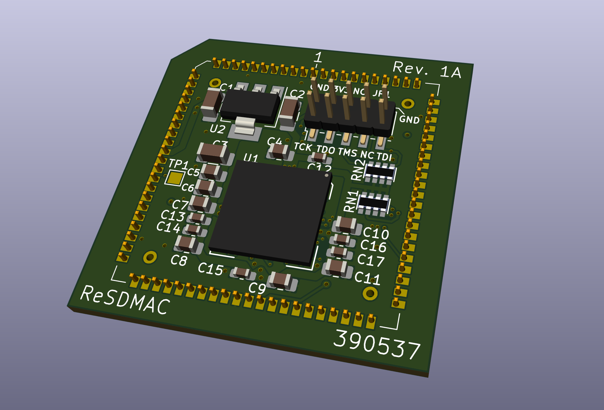
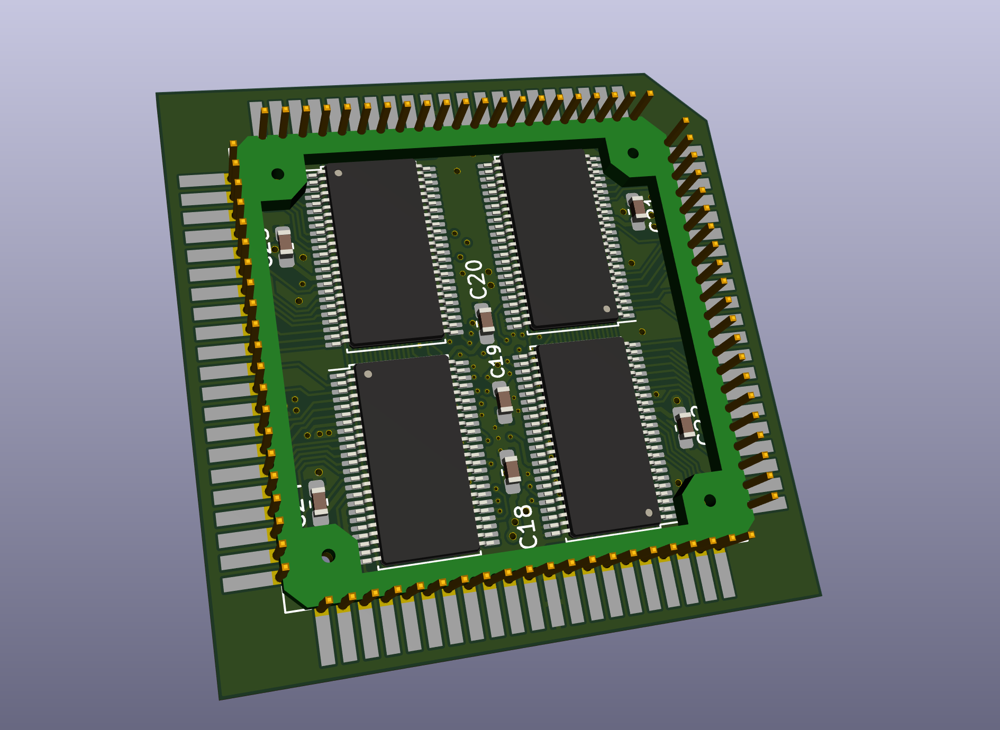
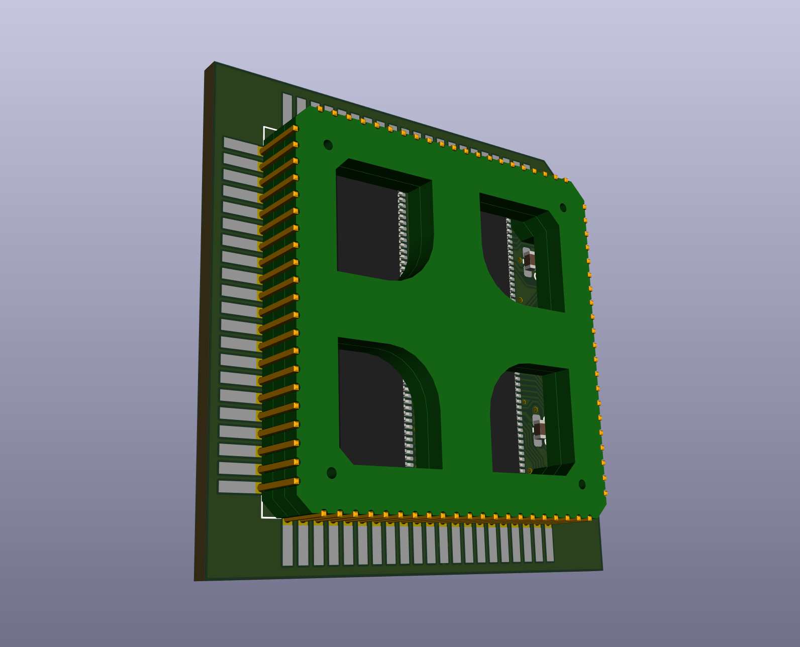
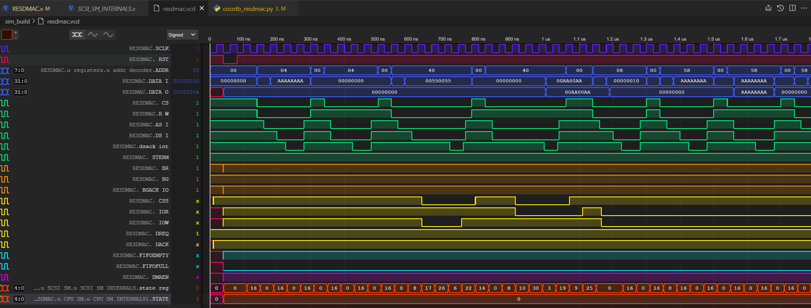
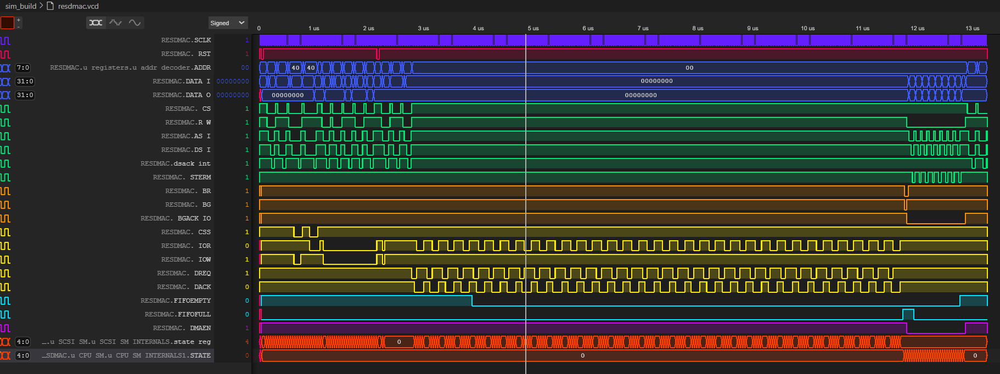

# ReSDMAC

  

##

### Introduction

This project is an exercise in reverse engineering the Commodore SDMAC 390537 as found in the Amiga 3000

This project was started with nothing more that the descriptions of the SDMAC operations and from the [Amiga 3000T Service manual](Docs/Commodore/Commodore_A3000T_Service_Manual.pdf), the [WD33c93 Datasheets](Docs/WD33C93/WD33C93B_WesternDigital.pdf) and some source code from the Amiga 3000 Linux scsi drivers.

Since then schematics for what appears to be the Rev 3(C) surfaced along with the original finite sate machine descriptions:

- [SDMAC_RevC.pdf](Docs/Commodore/sdmac_RevC.pdf)
- [Original Statemachine documentation](https://github.com/mbtaylor1982/ReSDMAC/issues/8)

### SDMAC Documentation

To collate together the technical details of the SDMAC a markdown document has been created and is [linked here](Docs/SDMAC.md)

### Pre-Production Board REV 1A

### Timing Diagrams

 Below are the VCD files output by the cocotb tests. these can be used to help verify the verilog code.

### Acknowledgements

Thankyou to all the people who have helped with this project especially:

- [Stefan Skotte aka Screemo](https://github.com/stefanskotte) For the long term loan of a REV 2 SDMAC.
- [Andy aka trixster1979](https://github.com/trixster1979) For the long term loan of a REV 4 SDMAC and dedicated testing of this on the AA3000+
- [Matt Harlum Liv2](https://github.com/LIV2) for checking over the my code and interpretation of the FSM schematics.
- [Chris Hooper aka CDH](https://github.com/cdhooper) For providing various adaptor PCBs and breakout boards, also for writing the [SDMAC test program](https://github.com/cdhooper/amiga_sdmac_test).
- [Jorgen Bilander](https://github.com/jbilander) For adapting the [ReAgnus](https://github.com/jbilander/ReAgnus) design to suit the SDMAC, and also for crating the [ReSDMAC-devboard](https://github.com/jbilander/ReSDMAC-devboard)
- [Stephen Leary AKA Terriblefire](https://github.com/terriblefire/) For publishing the verilog code for his projects and inspiring me to learn verilog and take on this project way back in 2021
- [Matthias Heinrichs](https://github.com/MHeinrichs) For providing the Original Statemachine documentation
- [Stefan Reinauer](https://github.com/reinauer) For his execelnt work showcasing this at Amiwest 2024

#### Honourable mentions

others that have helped out with words of encouragement and general support.

- [John Hertell aka Chucky](https://github.com/ChuckyGang)
- [Wrangler](https://github.com/Wrangler491)
- [shanshe](https://github.com/shanshe)

***
[![CC BY-SA 4.0][cc-by-sa-shield]][cc-by-sa]

This work is licensed under a
[Creative Commons Attribution-ShareAlike 4.0 International License][cc-by-sa].

[![CC BY-SA 4.0][cc-by-sa-image]][cc-by-sa]

[cc-by-sa]: http://creativecommons.org/licenses/by-sa/4.0/
[cc-by-sa-image]: https://licensebuttons.net/l/by-sa/4.0/88x31.png
[cc-by-sa-shield]: https://img.shields.io/badge/License-CC%20BY--SA%204.0-lightgrey.svg
