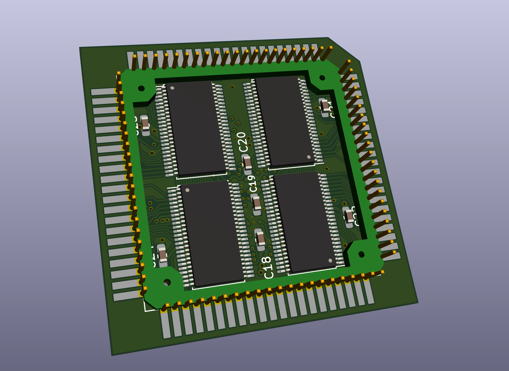
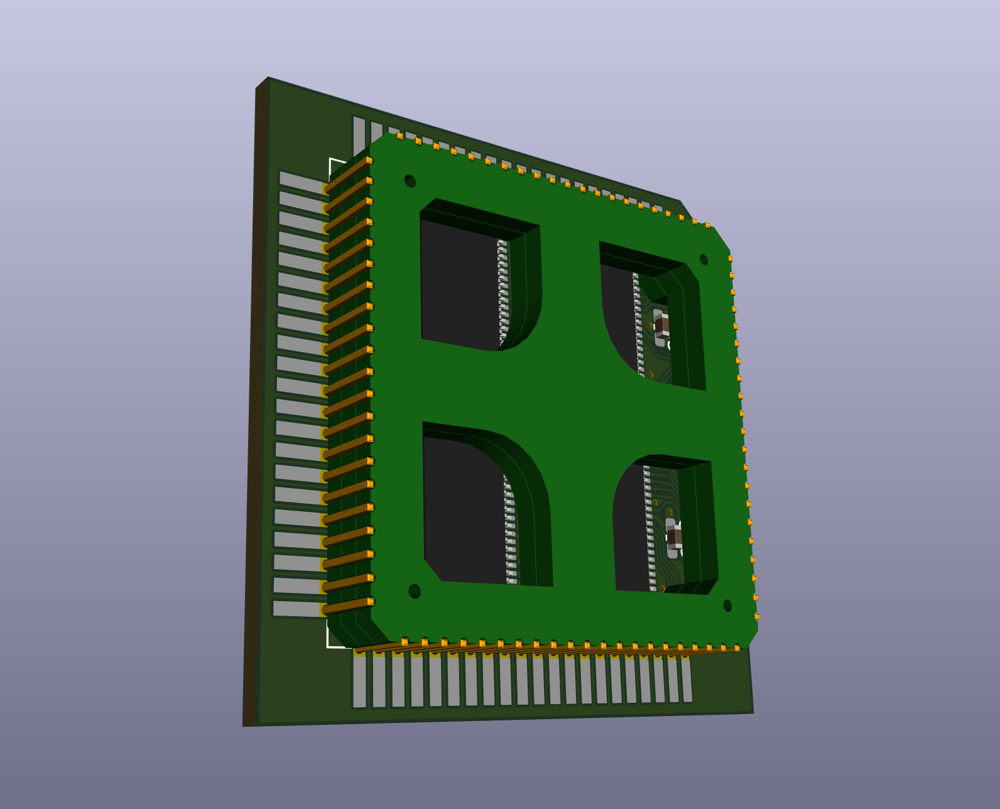
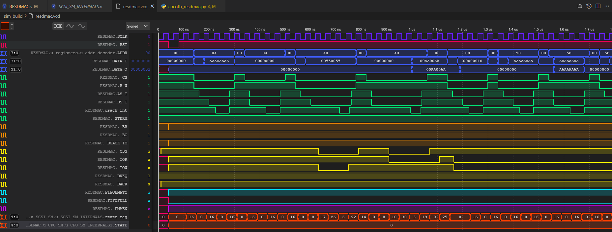
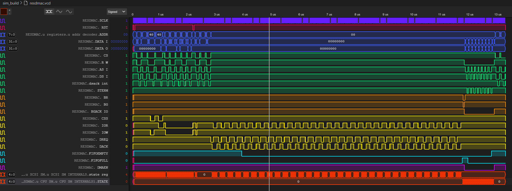

# ReSDMAC

------------------------------------------------------------------------

## Introduction

ReSDMAC is an independent, open-source community project to develop an
FPGA-based replacement for the SDMAC 390537 used in Commodore Amiga 3000
computers.

The project has been a community effort, with the PCB design by [Jorgen
Bilander](https://github.com/jbilander) and the Verilog implementation
by [Mike Taylor](https://github.com/mbtaylor1982). The project began as
an exercise in reverse engineering the behaviour and interfaces of the
SDMAC so that ageing or failed devices in original hardware could be
replaced with a modern implementation.

Development initially began using publicly available technical
information describing SDMAC operation, including the [Amiga 3000T
Service Manual](Docs/Commodore/Commodore_A3000T_Service_Manual.pdf), the
[WD33C93 datasheets](Docs/WD33C93/WD33C93B_WesternDigital.pdf), and
source code from the Amiga 3000 Linux SCSI drivers.

During the later development of ReSDMAC, additional historical technical
material surfaced, including schematics believed to relate to the Rev
3(C) SDMAC and original finite-state-machine documentation. These
materials have been useful as historical and technical references:

-   [SDMAC_RevC.pdf](Docs/Commodore/SDMAC_RevC.pdf)
-   [Original Statemachine
    documentation](https://github.com/mbtaylor1982/ReSDMAC/issues/8)

ReSDMAC is a new implementation written for this project. References to
original hardware, part numbers, documentation and trademarks are made
for identification, compatibility, historical and technical-reference
purposes.

## Independence and trademark notice

**ReSDMAC is an independent community project. It is not affiliated
with, endorsed by, sponsored by, authorised by, or licensed by Commodore
International Corporation or by any other owner of the Commodore or
Amiga trademarks.**

Commodore, Amiga, Amiga 3000, SDMAC and any other third-party names,
marks, product names or part numbers referenced by this project remain
the property of their respective owners where applicable. Their use
within this repository is solely to identify the original systems,
components and interfaces with which ReSDMAC is intended to be
compatible, and should not be interpreted as indicating any official
association or endorsement.

No Commodore or Amiga branding is claimed as part of the ReSDMAC
project.

## Third-party and historical material

This repository contains, references, or links to technical information
originating from third parties. Such material is included or referenced
for historical, research, interoperability and technical-reference
purposes.

Unless expressly stated otherwise, the ReSDMAC project does **not**
claim ownership of third-party manuals, datasheets, schematics,
trademarks, source code, documentation or other third-party material.
The ReSDMAC licence described below applies only to original ReSDMAC
material for which the project's contributors have the right to grant
that licence.

The presence of third-party material in, or links from, this repository
should therefore not be interpreted as placing that material under the
ReSDMAC licence.

If you are a rights holder and believe that material in this repository
has been included incorrectly, please open an issue or contact the
repository maintainer so that its provenance and appropriate treatment
can be reviewed.

## SDMAC Documentation

To bring together the technical details learned during development of
ReSDMAC, a project documentation page has been created and is [available
here](Docs/SDMAC.md).

## Pre-Production Board REV 1A

## Timing Diagrams

Below are VCD outputs from the cocotb tests. These have been used to
help verify the behaviour and timing of the Verilog implementation.

## Acknowledgements

Thank you to everyone who has helped with this project, especially:

-   [Andy aka trixster1979](https://github.com/trixster1979) for the
    long-term loan of a REV 4 SDMAC and dedicated testing on the
    AA3000+.
-   [Chris Hooper aka CDH](https://github.com/cdhooper) for providing
    various adaptor PCBs and breakout boards, and for writing the [SDMAC
    test program](https://github.com/cdhooper/amiga_sdmac_test).
-   [Jorgen Bilander](https://github.com/jbilander) for adapting the
    [ReAgnus](https://github.com/jbilander/ReAgnus) design to suit the
    SDMAC, and for creating the
    [ReSDMAC-devboard](https://github.com/jbilander/ReSDMAC-devboard).
-   [Matt Harlum Liv2](https://github.com/LIV2) for reviewing my code
    and my interpretation of the FSM schematics.
-   [Matthias Heinrichs](https://github.com/MHeinrichs) for providing
    the original state-machine documentation.
-   [Stefan Reinauer](https://github.com/reinauer) for his excellent
    work showcasing ReSDMAC at Amiwest 2024.
-   [Stefan Skotte aka Screemo](https://github.com/stefanskotte) for the
    long-term loan of a REV 2 SDMAC.
-   [Stephen Leary AKA Terriblefire](https://github.com/terriblefire/)
    for publishing the Verilog code for his projects and inspiring me to
    learn Verilog and take on this project back in 2021.

### Honourable mentions

Others who have helped with words of encouragement and general support:

-   [John Hertell aka Chucky](https://github.com/ChuckyGang)
-   [shanshe](https://github.com/shanshe)
-   [Wrangler](https://github.com/Wrangler491)

------------------------------------------------------------------------

## Licence

Except for third-party material identified or referenced above, original
ReSDMAC material made available by the project's contributors under this
repository's current licensing terms is licensed under the [Creative
Commons Attribution-ShareAlike 4.0 International
License](https://creativecommons.org/licenses/by-sa/4.0/).

**Important:** this licence grant does not apply to third-party
trademarks, manuals, datasheets, schematics, documentation, source code
or other material for which the ReSDMAC contributors do not own or
control the relevant rights. Any such material remains subject to its
own applicable rights and licensing terms.
